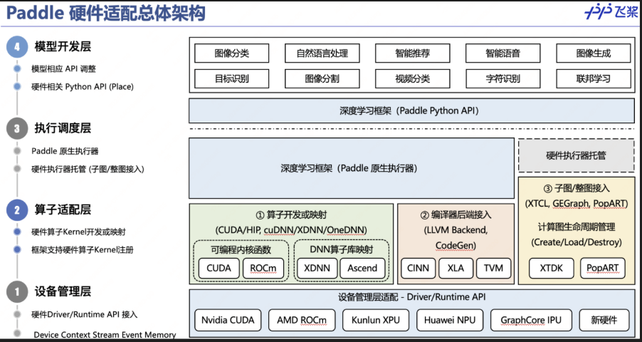
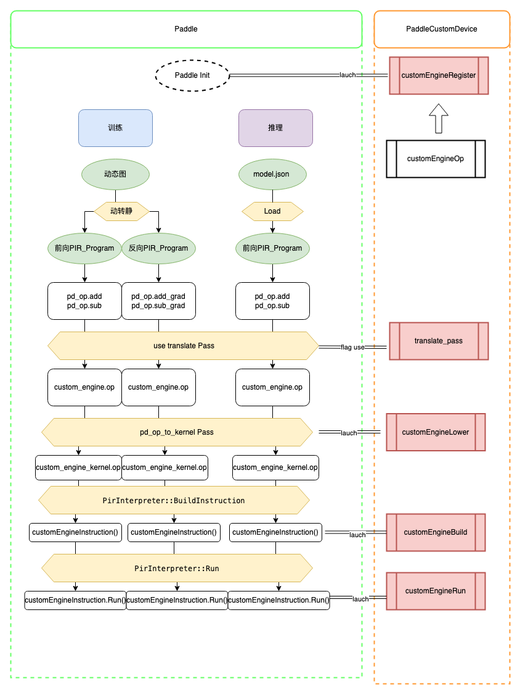
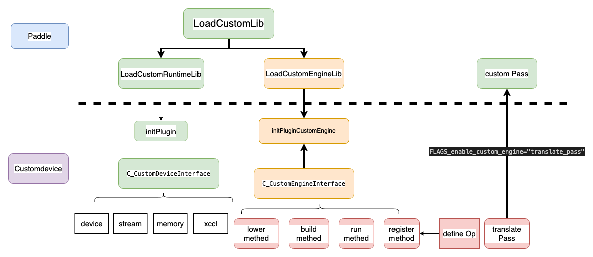

# customdevice 子图执行器接入机制

## 一、概要

### 1.背景

硬件接入paddle 完成执行的方式分为三类，
- 一类是定义kernel， 由paddle执行器进行调度，
- 一类是接入编译器，由编译器生成kernel paddle执行器执行。
- 一类是由硬件图引擎完成子图的构造，编译和执行。

本文档提供了基于Paddle3.0 版本下静态图IR([pir 介绍文档](https://github.com/PaddlePaddle/community/tree/master/pfcc/paddle-code-reading/IR_Dialect))的**插件式子图执行器接入**指导文档。供厂商做自定义的子图优化,以利用硬件子图执行的优化能力，提高模型训练和推理性能。

### 2.功能
1. paddle仓库提供基于pir 体系的**子图构造，编译，优化，执行**全流程的功能接口,并将子图接入的相关接口对外暴露，
2. 硬件开发者实现具体的执行逻辑，以编译链接的方式接入到paddle中，通过设置**FLAGS_enable_custom_engine="translate_pass1, translate_pass2"** 开启子图功能， 按照pass 执行先后顺序传递。

### 3.使用场景
1. 硬件厂商拥有**图引擎优化**能力，希望接入paddle**动转静训练/静态图推理**流程，提高模型训练和推理性能。

## 二、子图执行器接入流程

### 1. 子图执行器基于pir 的图管理和执行体系接入，需要适配如下内容：

__图注册管理体系__：
1. 定义用于描述硬件的子图的xxx_engine_op  相关方法，实现 register_custom_engine_op（）接口， 完成子图op 注册。_(该函数会在初始化硬件时执行)_。
2. 实现translate_pass 支持pir_program 中的图处理功能，实现将paddle op 转换成 xxx_engine_op的功能。_（该pass会在paddle 静态图执行器前处理中通过分Flag 控制调用）_。

__图编译执行体系__：

3. 实现``custom_engine_op_lower（C_CustomEngineLowerParams*）``接口,接入``pd_op_to_kernel_pass`` 完成子图的编译预处理 _(Paddle 中load 接入``HandleForCustomEngineOP`` 中lower方法)_。

4. 实现``graph_engine_build（C_CustomEngineInstruction）``，``graph_engine_execute(C_CustomEngineInstruction)`` 接口承担**构建和执行硬件子图**的功能， 内部管理xxx 的engine, 完成硬件编译，执行功能。_(Paddle 中load 接入``CustomEngineInstruction`` 中build / run 方法)_




硬件开发者在customdevice 仓库中实现上述方法， 将各方法注册在``InitPluginCustomEngine(CustomEngineParams*)``函数中
```c++
void InitPluginCustomEngine(CustomEngineParams* params) {
  memset(reinterpret_cast<void*>(params->interface),
         0,
         sizeof(C_CustomEngineInterface));

  params->interface->register_custom_engine_op = RegisterCustomEngineOp;
  params->interface->graph_engine_build = GraphEngineBuild;
  params->interface->graph_engine_execute = GraphEngineExecute;
  params->interface->custom_engine_op_lower = CustomEngineOpLower;
}
```

#### 样例代码：

**loadPluginCustomEngine**
[ customEngine参考样例](https://github.com/PaddlePaddle/Paddle/blob/develop/test/cpp/pir/custom_engine/fake_cpu_engine.h)
[gcu 参考样例](https://github.com/PaddlePaddle/PaddleCustomDevice/tree/develop/backends/gcu/custom_engine)

**translate pass**

op标记pass ,将Paddle 原生op 标记为可被圈图的op,建议命名为xxx_op_marker_pass.
op转换pass,将Paddle 原生op 转换成自定义子图op,建议命名为xxx_sub_graph_extract_pass.
[op标记pass参考样例](https://github.com/PaddlePaddle/PaddleCustomDevice/blob/develop/backends/gcu/passes/gcu_op_marker_pass.cc)
[op转换pass参考样例](https://github.com/PaddlePaddle/PaddleCustomDevice/blob/develop/backends/gcu/passes/gcu_sub_graph_extract_pass.cc)
[自定义Pass开发指导文档](https://github.com/PaddlePaddle/Paddle/blob/develop/paddle/fluid/pir/drr/README_cn.md)

### 2. 编译和加载

1. ``InitPluginCustomEngine(CustomEngineParams*)`` 函数负责将``CustomEngineParams`` 中的``C_CustomEngineInterface`` 各类接口设置完备。、
2. paddle中``loadCustomEngineLib`` 加载customdevice动态链接库后，将对应的``C_CustomEngineInterface`` 持有在全局变量中。 paddle 内执行逻辑从全局变量中获得相应的函数接口，在运行时调用相应的定义。
3. ``translate_pass`` 在paddle 静态图执行器前处理中通过Flag 控制调用。


